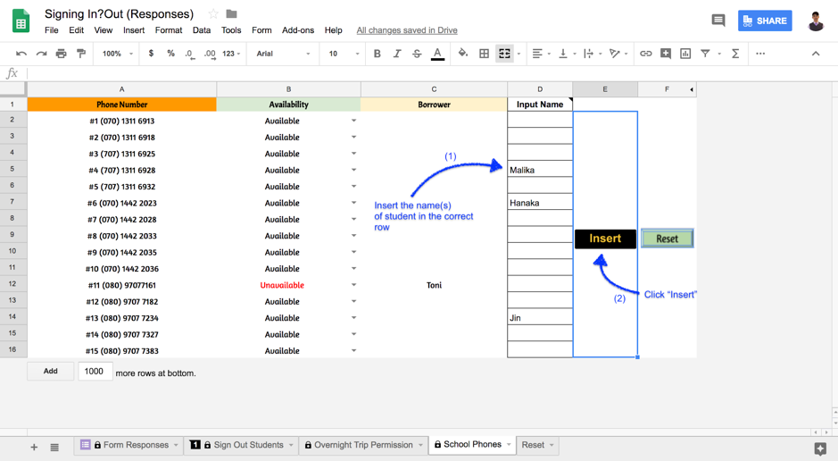
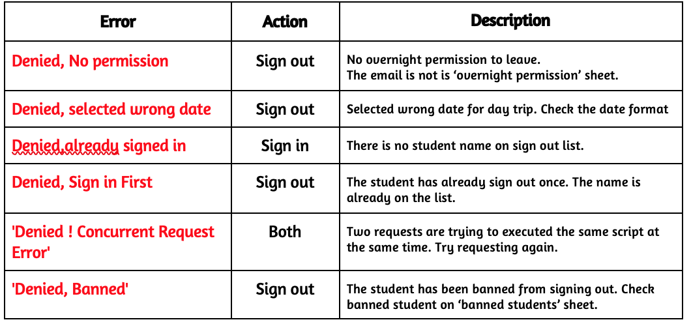

# System Navigation
The system is created based on Google Form, Google Spreadsheet and Google App Script. 

## Customers : 
1.	End users : Students
2.	Moderators : Faculty on duty
3.	Administrators
	
## Actions:

### Sign Out (User)

1.	Users submit sign out requests by filling out the Google form
2.	All the information will be submitted to be processed
3.	If overnight stay, system will check if permission has been granted by overnight/extended absence manager.
    * No : The response will be “Permission has not been granted, see Overnight/Extended stay manger”
    * Yes : Sign out successful, user info will be listed in “Sign Out Students” sheet in response spreadsheet.
4.	System will also check if the users have already signed out once
    * Yes : The response will be “Sign Out failed, sign in first.” 
    * No : Sign out successful, user info will be listed in “Sign Out Students” sheet in response spreadsheet. 

### Sign In (User)
1.	Users submit sign in request by filling out the same Google form
2.	User choose their name from options which are auto-generated from “Sign Out Students” sheet. 
3.	All the information will be submitted to be processed. 
4.	User’s name will be deleted from “Sign Out Students” sheet and “overnight trip permission” sheet as well if it is an overnight trip.

### Sign in Reminder Service (System)
1.	The system will check “Sign Out Students” sheet every hour to find those who are 1 hour late and still have not signed back in. 
2.	The system will send a reminder email to those students to sign in or contact the teacher in charge / advisor as the situation warrants. 

## Direction for  Moderators

### Important Note: 
  * Any modifications on any of these files will result in system failure. Therefore, all the important range on spreadsheet will be protected from editing. 
  *  Information about students who sign out can be found in “Sign Out Students” sheet.

### Sign a student In : 
If a teacher wishes to sign a student in, please select the student name or any column in the same row and then click the  `Sign in` button. After signing a student in using this method, a “Failed, Already signed in” message will shows up if the student submit another sign in request. 

### Resetting Phones Availability Status : 
When A student return a school phone, a faculty/staff can reset the availability status in School Phones sheet. 

### Inserting Names of School Phone Borrowers :  

#### Checking Out Phone : Limitation and potential issues: 
1.	The phone list  and student sign in list on the form get update every time the form get submitted. The form cannot get updated immediately when students are filling the form. Therefore, if many students are filling the form at the same time, they might not see the most updated phone data on the form. 
2.	Borrowing Phone: Please refer to “School Phone” sheet for the information regarding the names of borrowers instead of “Form Responses” sheet since the latter contains all the requests including the unsuccessful ones. 

## Note for  Overnight/Extended Stay Manager
Students’ Emails whose overnight trip permission have been approved need to be added to “Overnight Trip Permission” on spreadsheet for the verification process. 

Verification failure will result in students receiving a notification email as shown below: 

## Sharing and Permission
App script requires permission and authorization from moderators who are using the spreadsheet to operate. 

The Script operates on both the Google form and the Spreadsheet. Therefore, please share both the Google Form and the Spreadsheet with moderators with permission to Edit. The easiest way is to share the entire folder. 

## Type of Error Messages
There are many reasons that causes a request to fail. 

## Banning Student from Signing Out
In order to ban a student from signing out, please list his/her email on ‘Banned Students’ sheet.
Those whose email is listed on the sheet will not be able to sign out. He/she will receive a notification email as his/her request has been denied.  

## Data Reset Schedule

### Automatic Data Reset 
All the form responses and data in the spreadsheet will automatically deleted every one month. (can be changed if preferred). 

### Manual Data Reset
Manual Data reset can be performed by clicking on any preferred reset buttons in the reset sheet. 

